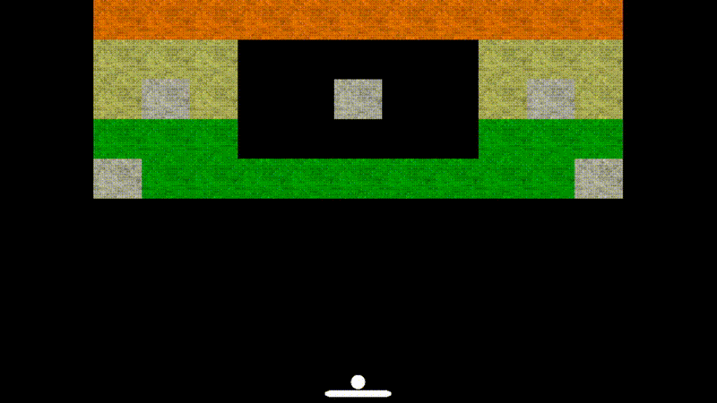

# Breakout clone from scratch using OpenGL and C++

# Building on Windows

TODO: Setup CMake

You should be able to open the Solution file that was generated by Visual Studio
2022 and build the project from there. Other versions may or may not work.

There are precompiled 64 bit binaries in the "deps" folder for GLFW and GLEW
which are all statically linked.

In the "src/vendor" folder there are header only libraries such as glm and
stb_image.
